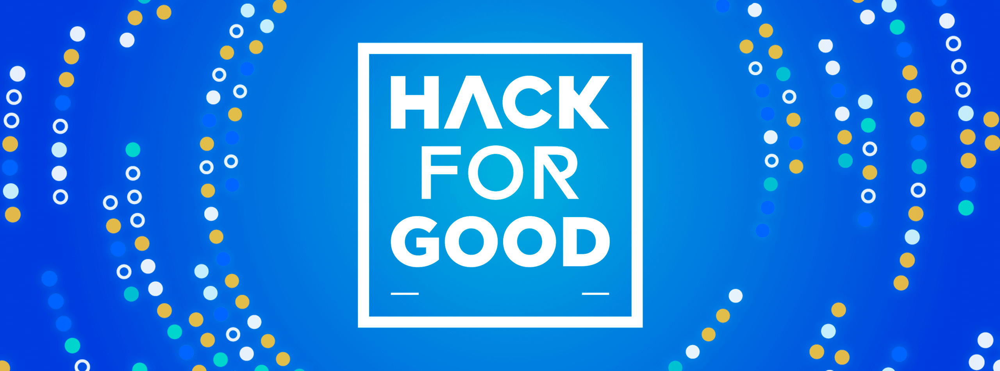

# HackForGood22
HackForGood is where we create digital solutions for social problems. My team came up with the idea of creating an artificial inteligence that could simplify law protocols and complex administration texts into a shorter text that can be understood by people with functional diversities. 

https://www.fundaciontelefonica.com/noticias/los-estudiantes-de-los-campus-de-programacion-42-participaran-en-hackforgood-el-mayor-hackathon-de-nuestro-pais/

  

Oct.22
